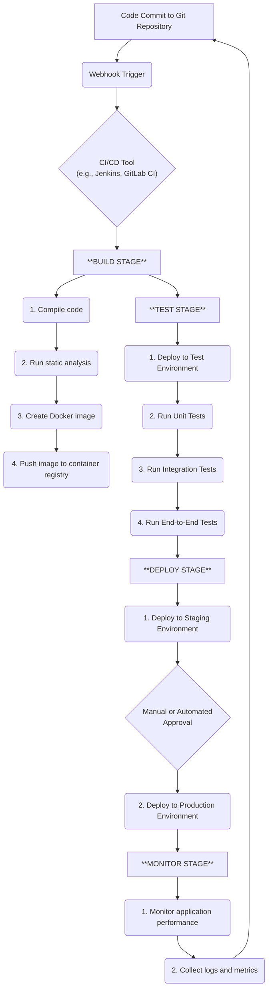
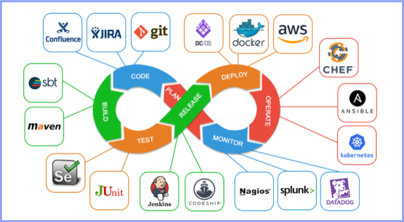

# CI/CD Fundamentals

- Intro to CI/CD and pipeline stages
- Why automation matters
- Diagramming a sample pipeline
- Hands-on: Plan your app's CI/CD pipeline

# Understanding CI/CD Pipelines

A **CI/CD pipeline** automates the steps from code commit to deployment, ensuring new features and bug fixes reach production quickly and reliably.  
Instead of doing everything manually, the pipeline runs automatically every time developers update the code.

This guide explains the **main stages of a CI/CD pipeline** with a simple diagram and real-world examples.

---

## 📊 Sample CI/CD Pipeline Diagram



---

## 🟢 1. Source Stage

This is where the pipeline starts.

- **Action:** Developers commit their code changes to a version control system (like Git).
- **Trigger:** The repository sends a webhook to the CI/CD server, starting the pipeline automatically.
- **Examples:** GitHub, GitLab, Bitbucket.

💡 _Think of this as: "I pushed my code, now the pipeline begins its work automatically."_

---

## 🔨 2. Build Stage

In this stage, the source code is turned into a runnable application.

- **Compile code:** Convert the source into executables or artifacts.
- **Static analysis:** Check the code for bugs, style issues, or security flaws without running it.
- **Containerization:** Build a Docker image (if using containers).
- **Push to registry:** Store the built image in a registry like Docker Hub.

💡 _Imagine baking a cake: ingredients = source code, recipe = build process, final cake = Docker image or executable._

---

## 🧪 3. Test Stage

This ensures the application works as expected before release.

- **Deploy to test environment:** The app runs in a temporary environment.
- **Automated tests include:**
  - **Unit Tests** → check small pieces of code.
  - **Integration Tests** → check if modules work together.
  - **End-to-End Tests** → simulate a user journey.

❌ If tests fail, the pipeline stops, and the team is notified.

💡 _Like checking the cake: tasting a small slice, checking layers, and testing the full flavor before serving._

---

## 🚀 4. Deploy Stage

If tests pass, the app is ready to be deployed.

- **Deploy to staging:** A copy of production for final checks.
- **Approval:** Sometimes manual approval is required; sometimes fully automated.
- **Deploy to production:** The app goes live. Techniques like **blue/green** or **canary deployments** minimize downtime.

💡 _This is like serving the cake to guests — but only after testing it in the kitchen (staging)._

---

## 📈 5. Monitor Stage

Deployment isn’t the end — monitoring keeps the app healthy.

- **Monitor performance:** Collect logs, metrics, and traces.
- **Feedback loop:** Any issue detected is reported back, and the cycle starts again.

💡 _This is like watching how guests react to the cake and improving the recipe next time._

---

## 🎓 Key Takeaways

- CI/CD = **Continuous Integration + Continuous Delivery/Deployment**.
- Automates the process from **code commit → build → test → deploy → monitor**.
- Ensures faster releases, fewer errors, and continuous improvement.
- Widely used tools: **Jenkins, GitHub Actions, GitLab CI/CD, CircleCI, TravisCI**.

---

### A bit more


---


---


---



---

## Learning CI/CD With Github Runners

# 🚀 Learning GitHub Actions CI/CD (From Basics to Intermediate)

This guide will take you step by step into **GitHub Actions (CI/CD)**. Each section is a small “piece” of learning you can try, and at the end we’ll combine everything into a full pipeline.

---

## 0) What is YAML?

**YAML** is just a config format.

- **Key & value:**
  ```yaml
  name: Build
  ```
- **Lists:**
  ```yaml
  steps:
    - name: Checkout
    - name: Test
  ```
- **Indentation matters** (use spaces, not tabs).
- **Comments** with `#`.

---

## 1) Core Idea of GitHub Actions

- A **workflow** = a YAML file in `.github/workflows/`.
- Workflows run on **runners** (VMs provided by GitHub or your own machine).
- Workflows have:
  - **Triggers (`on`)** → when to run (push, pull_request, schedule, manual).
  - **Jobs** → run in parallel by default.
  - **Steps** → executed top to bottom inside a job.
  - **Actions** → reusable steps (e.g., `actions/checkout@v4`).
  - **run** → shell commands.

---

## 2) First Workflow (Hello World)

Create `.github/workflows/hello.yml`:

```yaml
name: Hello CI # Display name in GitHub UI

on: # Triggers that start this workflow
  push: # Fire on a push event
    branches: [main] # Only when branch is main
  workflow_dispatch: {} # Allow manual run from Actions tab

jobs: # Collection of jobs (run in parallel by default)
  hello: # Job identifier
    runs-on: ubuntu-latest # Use latest Ubuntu runner VM
    steps: # Ordered list of steps for this job
      - name: Checkout code # Step 1: pull repository contents into runner
        uses: actions/checkout@v4 # Reusable action that performs the checkout
      - name: Say hello # Step 2: run a shell command
        run: echo "Hello from GitHub Actions!" # Actual shell command executed
```

Push to `main` → check **Actions** tab. 🎉

---

## 3) Runners 101

- **GitHub-hosted runner:**  
  `runs-on: ubuntu-latest` (also `windows-latest`, `macos-latest`).

- **Self-hosted runner:**  
  Install agent on your own machine/VM.
  ```yaml
  runs-on: [self-hosted, linux, x64]
  ```

⚠️ Self-hosted runners must be secured — they have repo & secrets access.

---

## 4) Simple Node.js CI

```yaml
name: Node CI # Node.js continuous integration workflow

on: # Triggers
  pull_request: # Run for every PR targeting the repo
  push: # Also run on pushes
    branches: [main] # Restrict pushes to main branch

jobs:
  ci: # Single job named 'ci'
    runs-on: ubuntu-latest # GitHub-hosted Ubuntu environment
    steps:
      - uses: actions/checkout@v4 # 1. Fetch repository code

      - name: Setup Node # 2. Install & configure Node.js
        uses: actions/setup-node@v4
        with:
          node-version: "20" #    Desired Node.js version
          cache: "npm" #    Enable npm dependency caching

      - name: Install deps # 3. Clean, reproducible install
        run: npm ci #    Uses package-lock for consistency

      - name: Lint # 4. Static code analysis (if script exists)
        run: npm run lint --if-present #    --if-present avoids failure if missing

      - name: Test # 5. Execute test suite
        run: npm test -- --ci --reporters=default #    CI flag ensures non-interactive output
```

---

## 5) Artifacts (Save Outputs)

Upload things like build bundles or coverage:

```yaml
- name: Build app # Compile / bundle the project (if script exists)
  run: npm run build --if-present # Skip gracefully when no build script

- name: Upload build # Persist build output as an artifact
  uses: actions/upload-artifact@v4
  with:
    name: web-dist # Logical artifact name
    path: dist/ # Directory or file path to upload
```

---

## 6) Matrix Builds (Multiple Versions)

```yaml
jobs:
  test-matrix: # Job that runs across a matrix
    runs-on: ${{ matrix.os }} # Runner OS chosen per matrix row
    strategy:
      matrix:
        os: [ubuntu-latest, windows-latest] # Two operating systems
        node: [18, 20] # Two Node versions (creates 4 combos)
    steps:
      - uses: actions/checkout@v4 # Checkout code for this combo
      - uses: actions/setup-node@v4 # Configure Node runtime
        with:
          node-version: ${{ matrix.node }} # Version from matrix
          cache: npm # Cache dependencies
      - run: npm ci # Install dependencies
      - run: npm test -- --ci # Run tests in CI mode
```

---

## 7) Secrets and Environment Variables

- Add **secrets** in Repo → Settings → Secrets → Actions.
- Use in workflow:
  ```yaml
  env: # Environment variables available to subsequent steps
    NPM_TOKEN: ${{ secrets.NPM_TOKEN }} # Inject secret token securely (not printed)
  ```

Example: Publish to npm on tag:

```yaml
on: # Trigger section
  push:
    tags: ["v*.*.*"] # Run only when pushing version tags

jobs:
  publish:
    runs-on: ubuntu-latest # Use hosted Ubuntu runner
    steps:
      - uses: actions/checkout@v4 # Fetch repository contents
      - uses: actions/setup-node@v4 # Install Node and set npm registry context
        with:
          node-version: "20" # Specify Node version
          registry-url: "https://registry.npmjs.org" # Point npm to public registry
      - run: npm ci # Clean install dependencies
      - run: npm publish # Publish package
        env:
          NODE_AUTH_TOKEN: ${{ secrets.NPM_TOKEN }} # Auth token for publish
```

---

## 8) Deploy Example (GitHub Pages)

```yaml
name: Deploy Pages # Build & deploy static site to GitHub Pages

on:
  push:
    branches: [main] # Trigger on main branch updates

permissions: # Restrict permissions to least privilege
  contents: read # Read repository contents
  pages: write # Allow publishing to Pages
  id-token: write # Required for OpenID Connect auth

jobs:
  build:
    runs-on: ubuntu-latest
    steps:
      - uses: actions/checkout@v4 # Checkout repository code
      - uses: actions/setup-node@v4 # Install Node.js toolchain
        with: { node-version: "20", cache: "npm" } # Use Node 20 + enable npm cache
      - run: npm ci && npm run build # Install dependencies then build project
      - uses: actions/upload-pages-artifact@v3 # Package build output for deploy step
        with:
          path: ./dist # Directory containing static site files

  deploy:
    needs: build # Wait for successful build job
    runs-on: ubuntu-latest
    steps:
      - uses: actions/deploy-pages@v4 # Deploy artifact to GitHub Pages
```

---

## 9) Docker Build & Push (to GitHub Container Registry)

```yaml
name: Build & Push Image # Build and publish Docker image to GHCR

on:
  push:
    branches: [main] # Trigger only on main branch pushes

jobs:
  docker:
    runs-on: ubuntu-latest # Hosted Ubuntu runner
    steps:
      - uses: actions/checkout@v4 # Retrieve repository source

      - name: Log in to GHCR # Authenticate CLI to GitHub Container Registry
        run: echo ${{ github.token }} | docker login ghcr.io -u ${{ github.actor }} --password-stdin

      - name: Build image # Build image & persist tag
        run: |
          IMAGE=ghcr.io/${{ github.repository }}:sha-${{ github.sha }}  # Unique tag from commit SHA
          docker build -t $IMAGE .                                   # Build local image
          echo "IMAGE=$IMAGE" >> $GITHUB_ENV                        # Export variable for later steps

      - name: Push image # Push image to remote registry
        run: docker push $IMAGE
```

---

## 10) Advanced Features

- **Environments with approvals:** require manual approval before prod deploy.
- **Concurrency:**
  ```yaml
  concurrency: # Avoid duplicate overlapping runs
    group: ci-${{ github.ref }} # Group by ref (branch / tag)
    cancel-in-progress: true # Cancel older run when new one starts
  ```
- **Permissions:** limit what workflows can access.

---

## 11) Self-Hosted Runner (Basics)

1. Go to repo → Settings → Actions → Runners → New self-hosted runner.
2. Install agent with `./config.sh`.
3. Run with `./run.sh`.
4. Use in workflow:
   ```yaml
   runs-on: [self-hosted, linux] # Use a self-managed runner labeled 'linux'
   ```

---

## 12) Debugging Tips

- Check **raw logs** in each step.
- Add debug logs:
  ```yaml
  run: echo "::debug::Debug info" # Emit debug-level annotation to logs
  ```
- Re-run failed jobs.
- Use conditions:
  ```yaml
  if: github.event_name == 'push' # Step executes only for push events
  ```

---

## Putting It All Together (Node + Docker CI/CD)

```yaml
name: CI/CD (Node + Docker)                   # Full pipeline: test code then build & push image

on:
  push:
    branches: [ main ]                       # Run on pushes to main
  pull_request:                              # Also validate pull requests
  workflow_dispatch:                         # Allow manual triggering
  push:                                      # (Duplicate 'push' key for tag pattern example)
    tags: ['v*.*.*']                         # Run on version tags (v1.2.3)

jobs:
  test:                                      # First job: install & test
    runs-on: ubuntu-latest
    steps:
      - uses: actions/checkout@v4            # Checkout repository
      - uses: actions/setup-node@v4          # Setup Node.js runtime
        with:
          node-version: 20                   # Use Node 20
          cache: npm                         # Enable npm dependency cache
      - run: npm ci                          # Clean install deps
      - run: npm test                        # Execute test suite

  docker:                                    # Second job: build container image
    needs: test                              # Only runs if 'test' succeeds
    runs-on: ubuntu-latest
    steps:
      - uses: actions/checkout@v4            # Fresh checkout (job isolation)
      - run: echo ${{ github.token }} | docker login ghcr.io -u ${{ github.actor }} --password-stdin  # Login to GHCR
      - run: |
          IMAGE=ghcr.io/${{ github.repository }}:sha-${{ github.sha }}  # Tag image with commit SHA
          docker build -t $IMAGE .                                     # Build the Docker image
          docker push $IMAGE                                           # Push to registry
```

---

## 🎓 Roadmap to Practice

1. Make a Hello workflow.
2. Add Node.js CI (install, test).
3. Use cache and artifacts.
4. Try matrix builds.
5. Add secrets and env.
6. Add a deploy job (Pages, Docker, server).
7. Protect deploys with approvals.
8. Try a self-hosted runner.

---

## 📝 Assignment 1: Multi-Branch Environment Deployment

### 📌 Scenario

Your team maps Git branches to deployment environments.

| Branch / Event     | Environment | Deploy? | Notes                 |
| ------------------ | ----------- | ------- | --------------------- |
| `main` (push)      | production  | ✅      | Live environment      |
| `dev` (push)       | qa          | ✅      | Test / QA environment |
| `pull_request` any | (none)      | ❌      | CI (lint + test only) |

### ✅ Goals

1. Run CI (lint + test) for all pull requests (no deploy).
2. Deploy to QA only when pushing/merging to `dev`.
3. Deploy to Production only when pushing/merging to `main`.
4. Pass an artifact (e.g., build or test report) from CI to deploy jobs.

### 🧱 Job Design

| Job           | Runner             | When                          | Purpose                                   |
| ------------- | ------------------ | ----------------------------- | ----------------------------------------- |
| `ci`          | GitHub Ubuntu host | PRs, pushes to `dev` / `main` | Install, lint, test, create artifact      |
| `deploy_qa`   | self-hosted        | Push to `dev`                 | Simulate QA deploy (use artifact)         |
| `deploy_prod` | self-hosted        | Push to `main`                | Simulate Production deploy (use artifact) |

### 💡 Extra Challenges

- Add a concurrency group to prevent overlapping deploys:
  ```yaml
  concurrency:
    group: deploy-${{ github.ref }}
    cancel-in-progress: true
  ```
- Fail fast if lint/test fails (already implicit via `needs`).
- Add a notification step (Slack/Teams) after production deploy.

---

## 📝 Assignment 2: Matrix Testing & Conditional Build

### 📌 Scenario

You must ensure your Node.js project works across multiple runtimes **before** building artifacts.

### ✅ Goals

1. Run tests on Node versions: 16, 18, 20.
2. All matrix test jobs must pass before the build job runs.
3. Build only when:
   - Push to `main`, OR
   - Push a version tag matching `v*.*.*`.
4. Store:
   - Test results under `test-results/` (each matrix variant).
   - Build output under `dist/`.
5. Use artifacts to collect outputs.
6. (Optional) Add manual approval before publishing build artifact.
7. (Optional) Cancel superseded runs on same branch.

### 🧱 Job Design

| Job             | Purpose                           | Parallel?  | Trigger Filter            |
| --------------- | --------------------------------- | ---------- | ------------------------- |
| `test` (matrix) | Multi-version test validation     | Yes        | Always (push/PR)          |
| `build`         | Single build after all tests pass | No (needs) | Conditional (main or tag) |

### 💡 Extra Challenges

- Add a summary step that concatenates test results.
- Fail workflow if a minimum number of tests decreases (track via saved artifact + diff).
- Introduce a scheduled run (cron) to test nightly against `node:current`.
- Add a manual `workflow_dispatch` input to skip build.

---
